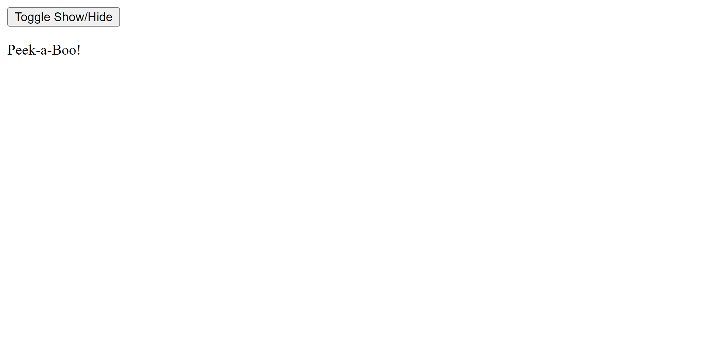
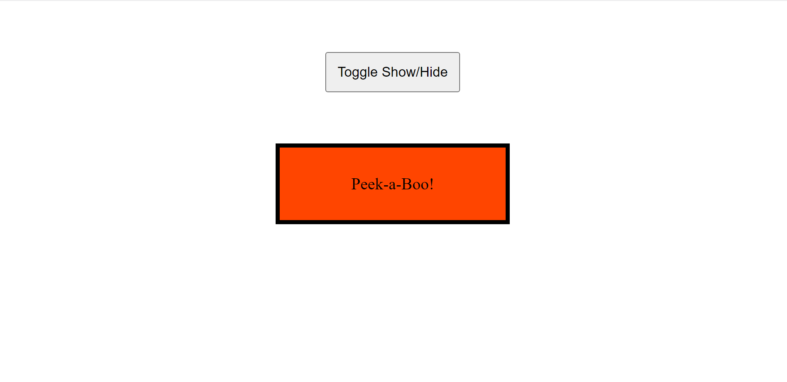
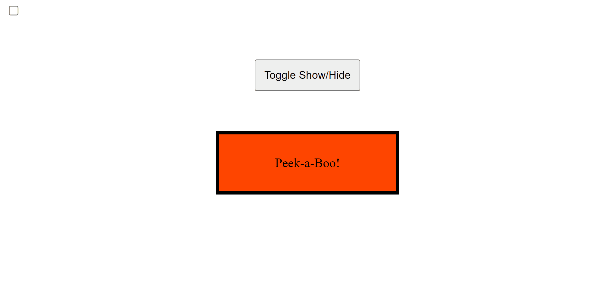
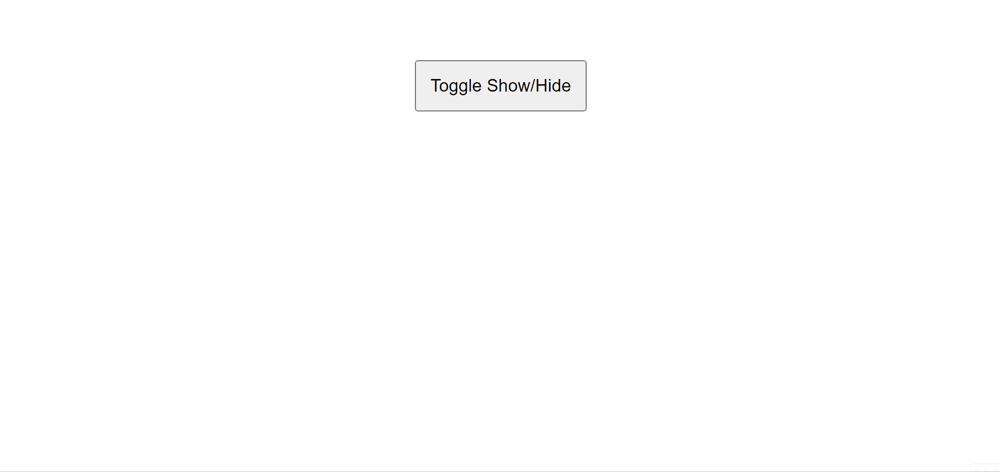

I've found that as I learn more about a particular language or framework, I appreciate working with that language or framework even more. Little tricks like this really fascinate me as an alternative (although, mostly useless from a practical perspective) approach to a common problem: How do I make my button work?

The standard (and probably the easiest) approach would be to link up a JavaScript script to your HTML file, create an event listener, and build out a callback function for the button's click event. But what if you could make a functional (albeit limited) button using purely HTML and CSS?

# Overview

This solution makes use of a small handful of HTML and CSS "tricks"/features, including [HTML form labels](https://developer.mozilla.org/en-US/docs/Web/HTML/Element/label), [CSS pseudo-classes](https://developer.mozilla.org/en-US/docs/Web/CSS/Pseudo-classes) and [CSS sibling combinators](https://developer.mozilla.org/en-US/docs/Web/CSS/General_sibling_combinator). If you are unfamiliar with any of these concepts, consider following the links to brush up on them before continuing.

Briefly, here is the solution: Wrap any HTML element (in this case, a button) with a label tag linked to a hidden HTML checkbox. Use that checkbox's "checked" pseudo-class to conditionally style the desired elements.

In order to demonstrate this solution in more detail, I will build a simple button that, when clicked, causes a textbox to appear or disappear.

# The Process

First, the following is placed in the `<body>` tags:

```html
<button class="toggle-message">Toggle Show/Hide</button>

<div class="message">
  <p>Peek-a-Boo!</p>
</div>
```

The first element is the `<button>` that will trigger the toggle event. The second element is the textbox that will appear when the button is clicked. For now, the textbox has no special behavior and is always visible.



Now, some basic styles are added to improve the demonstration's display:

```css
.toggle-message-btn {
  margin: 50px auto;
  padding: 10px;
  display: block;
  cursor: pointer;
}

.message {
  width: 200px;
  background-color: orangered;
  margin: 10px auto;
  padding: 10px;
  text-align: center;
  border: 4px solid #000;
}
```

Now the message box actually looks like a box!



Ok, onto the meat of the problem. First, there needs to be a checkbox element at or above the level of the message box element. This checkbox is essentially responsible for storing the state of the message box (is it open or closed?).

```html
<input type="checkbox" id="show-message" class="checkbox">

<button class="toggle-message-btn">Toggle Show/Hide</button>

<div class="message">
  <p>Peek-a-Boo!</p>
</div>
```

The checkbox needs an id so that it can be linked to an HTML label element using the label's `for` attribute.

Next, add the label. Wrap it around the button (or other element) that is going to execute the action on click, and make sure to include a `for` attribute with a value identical to the checkbox element's id.

```html
<input type="checkbox" id="show-message" class="checkbox">

<label for="show-message">
  <button class="toggle-message-btn">Toggle Show/Hide</button>
</label>

<div class="message">
  <p>Peek-a-Boo!</p>
</div>
```

In this case, an HTML button is being used as the event listener (so to speak). Since the button already listens and dispatches a click event, the event doesn't reach the checkbox label. This can be easily fixed by defining a `pointer-events: none` property to the button.

```css
.toggle-message-btn {
  margin: 50px auto;
  padding: 10px;
  display: block;
  cursor: pointer;
  pointer-events: none; /* new */
}
```

Now, when the elements inside the label are clicked, the checkbox state is toggled. This is possible because of the way HTML labels work. If given a `for` attribute that matches an id of an input element, clicking on the label itself will fire a click event on the input element as well. In this case, the label is almost like a portal for the click event to be sent to the checkbox.

Next, some simple CSS rules must be added to configure the textbox to only appear when the checkbox is 'checked'. The checkbox is acting as a store for the textbox's visible/hidden state. This state can be accessed through the `:checked` pseudo-class of a checkbox input. This pseudo-class in combination with CSS sibling selectors allows any child, sibling, or child of sibling element's styles to be controlled by the checkbox's state.

```css
.checkbox:checked ~ .message {
  background-color: royalblue;
}
```

Here, the general sibling selector is used to style any subsequent sibling element's with the class "message" relative to elements with the "checkbox" class that are checked (quite a mouthful, makes me happy that CSS isn't written in plain english). This rule will set the box's background color to `royalblue` when the checkbox is checked.



Then, set the textbox's styles to hide by default, and display when the checkbox is checked.

```css
.message {
  width: 200px;
  background-color: orangered;
  margin: 10px auto;
  padding: 10px;
  text-align: center;
  border: 4px solid #000;
  opacity: 0; /* new */
  transition: opacity 0.3s; /* new */
}

.checkbox:checked ~ .message {
  opacity: 1;
}
```

This implementation uses the `opacity` property to make the textbox invisible by default, then visible when the checkbox is checked. A transition property is also included to make the showing/hiding more visually appealing.

Lastly, the checkbox is not meant to be visible, as it's functionality is purely behind the scenes. It can be vanished by adding the `hidden` HTML attribute.

```html
  <input type="checkbox" id="show-message" class="checkbox" hidden>
```

And here's the final product:



# Steps

Here's a breakdown of the steps to build your very own HTML + CSS toggle button:
1. Define your static elements for both the control (button) and the targeted (manipulated) elements.
2. Create an `input` element with `type="checkbox"` and `id` attribute at the same level or above your targeted elements.
3. Wrap the controller element using a `label` tag that has a `for` attribute with the checkbox's id.
4. Select the target elements relative to the checkbox, making sure to select the checkbox's `:checked` pseudo-class.
5. Write the conditional style properties inside the rule created in step 4.
6. Hide the checkbox using the `hidden` HTML attribute. You can remove this attribute when bug-fixing to reliably see the state of the checkbox.

# Conclusion

Although this is a roundabout approach to solving a simple problem, it offers a fun little challenge to test your HTML and CSS knowledge and skills. I would encourage you to try this out for fun, and maybe see if you can put unique spins on it too. The **best** way to learn to code is by **practice**!